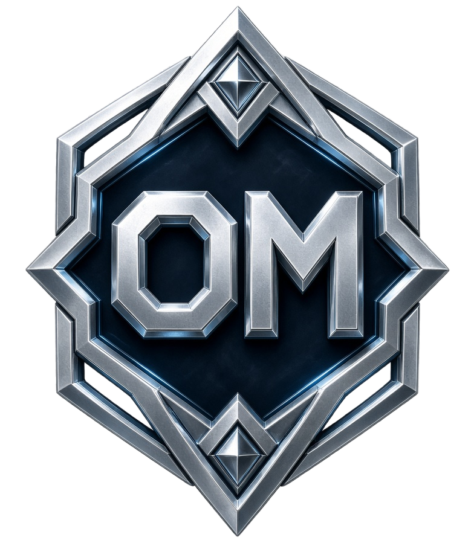
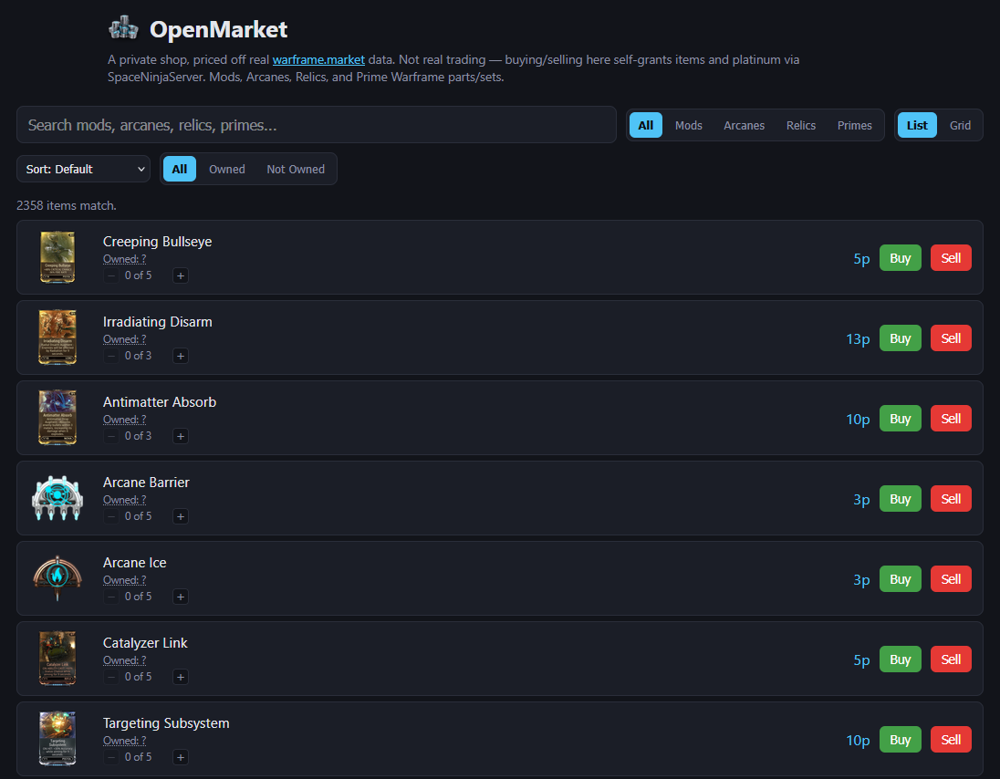
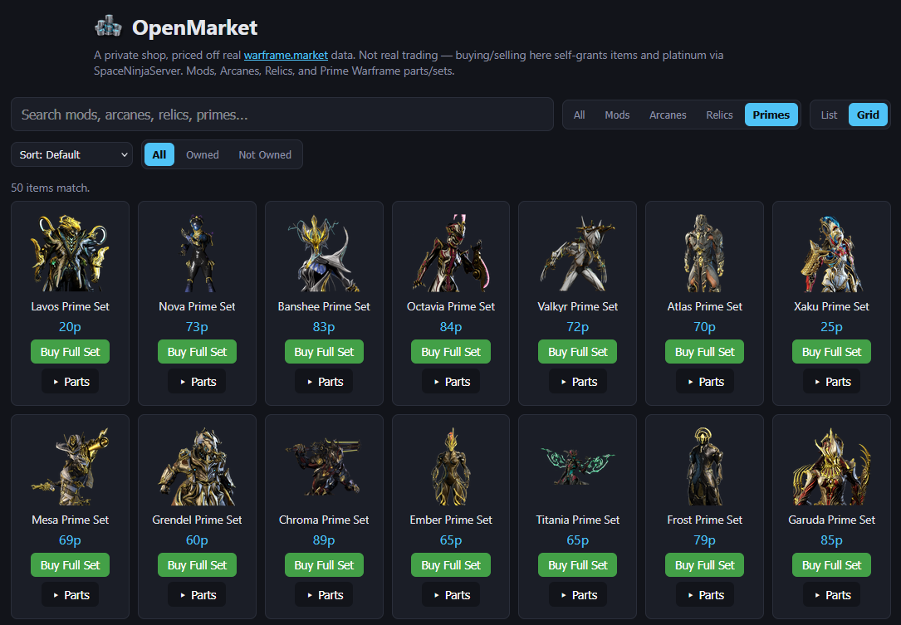
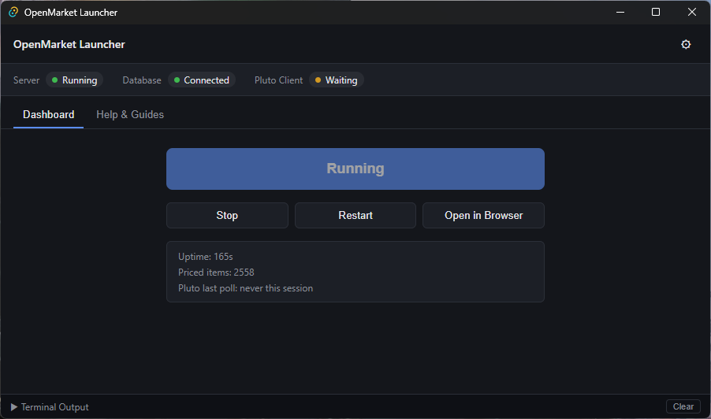

<p align="center">
  
</p>

<h1 align="center">OpenMarket</h1>
<p align="center">An OpenWF Market Emulator</p>

<p align="center">
  
  
  
  
  
  
  
</p>

A local, personal **shop** for [OpenWF](https://onlyg.it/OpenWF)-based
Warframe private servers, priced off real
[warframe.market](https://warframe.market) data. Search for an item, hit
Buy or Sell, and it's instantly granted or removed along with platinum —
no other player involved. Think of it as a single-player vending machine
stocked with real market prices, not an actual trading system.

## Disclaimer

- This is a **non-profit, community-built tool** — not affiliated with,
  endorsed by, or associated with Digital Extremes or Warframe in any way.
- It does **not** host, bundle, or distribute any proprietary Warframe
  assets. It's a client-side companion app: it reads public
  warframe.market pricing data and talks to a SpaceNinjaServer instance
  *you* already run.
- It only ever operates against a **private, self-hosted server instance
  you control** — there is no code path in this project that touches, or
  could interfere with, the official live Warframe servers.
- Free, source-available (AGPL-3.0), and strictly **non-commercial** —
  see [License](#license) below.

## Features

- **Mods, Arcanes, Relics, and Prime Warframe & Weapon parts/sets** — buy
  and sell at any rank (mods/arcanes) or refinement (relics).
- **Fully offline after first setup** — the catalog and real prices
  (historical median data from warframe.market) are cached to disk and
  never re-fetched automatically; one **"Update Data"** button refreshes
  everything on demand, whenever you have a connection. No internet, no
  problem in the meantime — this was built with Steam Deck/offline play
  specifically in mind.
- **Real icons**, extracted locally from your own Warframe install — no
  network dependency for art either. Optional one-time setup (see
  [DEVLOG.md](DEVLOG.md#offline--local-data-model)); items without it set
  up just show a placeholder instead of a broken image.
- **Live owned counts**, synced from your actual SpaceNinjaServer
  inventory, so Sell auto-disables on things you don't have.
- **Sort and filter** by name, type, price, rarity, relic era, or owned
  status; List and Grid views.
- **Desktop launcher** (Windows/Linux) that starts the backend for you,
  shows connection status, and streams logs — no terminal required.

Not covered (yet): skins/cosmetics, and selling a full Prime set as one
unit. See [DEVLOG.md](DEVLOG.md#known-limitations) for the complete list
and why.

## Screenshots & Media

<p align="center">
  <br>
  <sub>The shop's list view — search, filters, live owned counts, and prices.</sub>
</p>
<p align="center">
  <br>
  <sub>Grid view, filtered to Prime Warframe parts and sets.</sub>
</p>
<p align="center">
  <br>
  <sub>The desktop launcher — status dashboard, install/launch, live logs.</sub>
</p>

All media in [`media/`](media/) is licensed separately from the code —
see [`media/LICENSE.md`](media/LICENSE.md).

## Requirements

- Node.js 18+
- An OpenWF Bootstrapper install pointed at a SpaceNinjaServer instance
  you control

## Quick start

**Easiest**: grab the [desktop launcher](#desktop-launcher) — it handles
setup and starting the backend for you.

**Manual**:

```
cd server
npm install
npm start
```

Then copy `scripts/Market Sync.pluto` into your OpenWF `Scripts/` folder
and start it in-game — it's what actually talks to SpaceNinjaServer.
Open `http://127.0.0.1:7890/` in a browser while the game is running,
search for something, and hit Buy or Sell.

## Desktop launcher

`launcher/` is a small desktop app (Windows + Linux) that runs the
backend for you instead of a terminal window: one button to install
dependencies and launch, a status dashboard (server / price database /
script connection), and a live log view.

Download a release from the [Releases page](../../releases) once one's
published — Windows has two options: an installer (auto-updates itself)
or a portable `.zip` (extract anywhere, just run the exe, but you'll
need to manually grab new versions). Linux ships as an AppImage
(auto-updates). Either way, you'll need [Node.js](https://nodejs.org/)
18+ installed — the launcher checks for it and tells you if it's
missing, but doesn't install it for you.

Or build it yourself:

```
cd launcher
npm install
npm run tauri dev      # or: npm run tauri build
```

Building from source needs [Rust](https://rustup.rs/) in addition to
Node — a downloaded release doesn't.

## How it works

```
Browser  <-->  server/ (Node/Express)  <-->  warframe.market (read-only, prices)
                    ^  |
                    |  v
          scripts/Market Sync.pluto  <-->  SpaceNinjaServer
```

The backend never talks to SpaceNinjaServer directly — only the Pluto
script running inside the game does. The backend just queues up what you
clicked; the script polls for it and carries it out. This all runs on
`localhost` for one account — don't expose it to the network.

For the full architecture rationale, every confirmed API mechanism, and
a detailed history of what's been built and fixed, see
[DEVLOG.md](DEVLOG.md). For a quick-scan list of specific bugs that have
already been found and fixed (or are known and still open), see
[BUGS.md](BUGS.md).

## Known limitations

- No unique-instance cosmetics (skins) — warframe.market doesn't carry
  trade data for those at all.
- Can't sell a full Prime set as one unit, only its individual parts.
- No persistence — restarting the backend drops any order in progress.
- This is a fake economy: prices are real, but the platinum and items
  are self-granted, not tied to any other player or account.

More detail on each of these, plus smaller edge cases, in
[DEVLOG.md](DEVLOG.md#known-limitations).

## License

**Code**: [GNU AGPL-3.0](https://www.gnu.org/licenses/agpl-3.0.html)
with the [Commons Clause](https://commonsclause.com/) condition — free
to use, study, modify, and redistribute (including commercial products
*built on top of* it), but the software itself, or a substantially
similar derivative, may not be sold or offered as a paid product/service.
Full text: [LICENSE](LICENSE).

**Media** (`media/`): [CC BY-NC-SA
4.0](https://creativecommons.org/licenses/by-nc-sa/4.0/) — see
[media/LICENSE.md](media/LICENSE.md).

This project is intended to remain free, source-available, and
non-commercial. Note for the pedantic: the Commons Clause condition
means this isn't strictly "Open Source" by the [OSI's
definition](https://opensource.org/osd) (which permits commercial
resale) — it's more precisely called *source-available*, though the
source is fully open to read, modify, and self-host.
